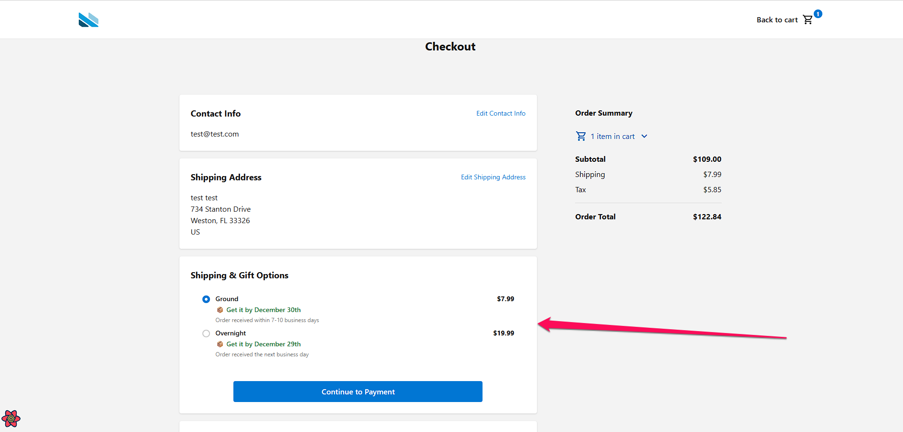
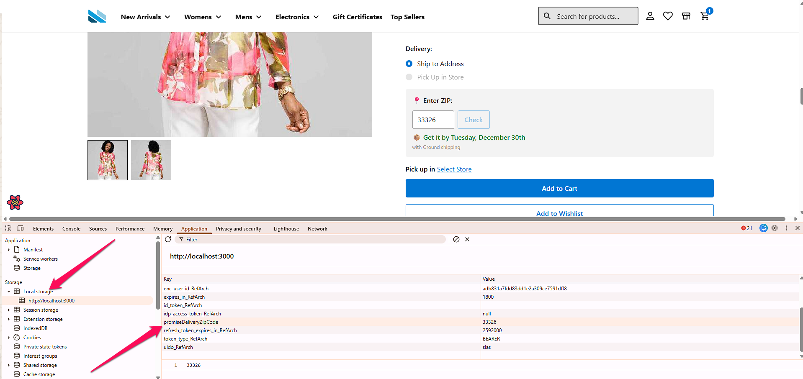
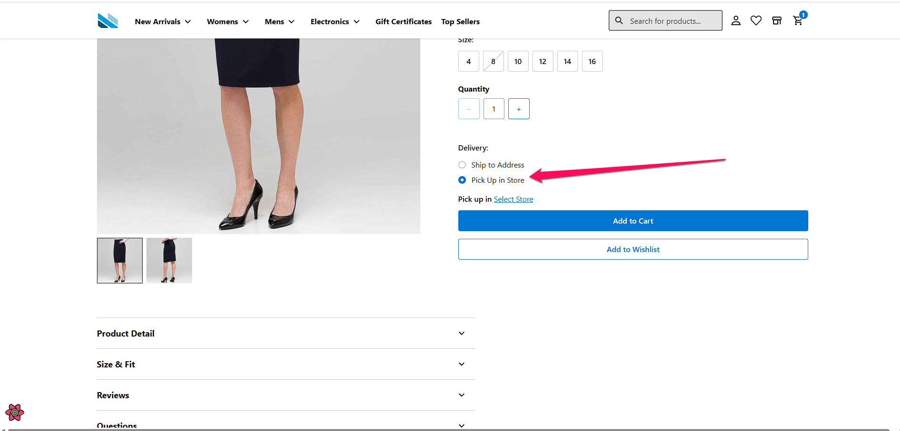

# Promise Delivery Date Narvar Challenge
This Github repo contains the code to solve the Challenge sent by Narvar on 2025-12-23. I've divided this README.md file into collapsible sections so it is easier to use and read. Below a table of contents with a brief description of each section

- **Challenge information:** contains the description and requirements of the challenge
- **Structure of the Repo, Quick Start, and NPM Scripts:** 
   - Contains the structure of the repo with a brief description
   - A quick start section with some npm commands to install the packages, run tests and upload the cartridge to SFCC
   - Other npm commands  to run pwa-kit unit tests, cartridge tests, etc
- **Considerations:** contains some things to consider when testing and reviewing this repo

<details>
<summary>Challenge Information</summary>
## Take-Home: Promise Delivery Date Engine

Build a delivery date promise feature for SFCC (SFRA + PWA-Kit) that shows customers estimated delivery dates on PDP and Checkout.

---

### The Problem

Customers want to know **when** they'll receive their order before buying. Build a widget that displays:

```
"Get it by January 15th"
```

---

### UI Placement

#### PDP (Product Detail Page)

```
┌─────────────────────────────────────────────┐
│  Product Name                               │
│  $49.99                                     │
│                                             │
│  ┌─────────────────────────────────────┐    │
│  │ 📍 Enter ZIP: [90210] [Check]       │    │
│  │                                     │    │
│  │ 📦 Get it by January 15th           │    │
│  └─────────────────────────────────────┘    │
│                                             │
│  [Add to Cart]                              │
└─────────────────────────────────────────────┘
```

- ZIP input field (US 5-digit only)
- Shows promise date after ZIP entry
- Persist ZIP in session for return visits

#### Checkout (Shipping Step)

```
┌─────────────────────────────────────────────┐
│  Select Shipping Method                     │
│                                             │
│  ○ Standard Shipping - $5.99                │
│    Get it by January 20th                   │
│                                             │
│  ○ Express Shipping - $12.99                │
│    Get it by January 17th                   │
│                                             │
│  ○ Overnight - $24.99                       │
│    Get it by January 15th                   │
└─────────────────────────────────────────────┘
```

- Promise date shown per shipping method
- Updates when shipping address changes
- Selected date stored in order custom attribute: `customerSelectedDeliveryDate`

---

### Calculation Logic

```
Promise Date = Ship Date + Transit Days (business days only)
```

| Factor | Rule |
|--------|------|
| **Ship Date** | Today if before 2 PM EST cutoff, else next business day |
| **Transit Days** | Based on origin→destination ZIP (use mock data) |
| **Business Days** | Exclude weekends and holidays |

#### Example

```
Order time:     Monday 1:30 PM EST (before cutoff)
Origin ZIP:     10001 (NYC)
Destination:    90210 (LA)
Transit time:   5 business days

Ship: Monday → Deliver: Next Monday
Display: "Get it by January 20th"
```

---

### Mock Transit Data

Use ZIP ranges to determine transit days from origin `10001`:

| Destination ZIP | Transit Days |
|-----------------|--------------|
| 00000-19999 | 1 |
| 20000-39999 | 2 |
| 40000-59999 | 3 |
| 60000-79999 | 4 |
| 80000-99999 | 5 |

---

### Deliverables

1. **SFRA cartridge** (`int_promise_delivery`)
2. **PWA-Kit extension**
3. **DESIGN.md** - Architecture, decisions, trade-offs, scale considerations
4. **README.md** - Setup instructions

---

### Submission & Evaluation

- Send a GitHub link with your code
- Be prepared for a 1-hour deep dive meeting to walk through your implementation

**We'll evaluate:** Working functionality, code quality, SFCC best practices, architecture, scalability, and documentation.

---

### Notes

- **Code must be working** — we will run it
- Use AI tools freely — be prepared to discuss your AI development process
- Focus on depth over breadth
- Document any assumptions
</details>


<details>
<summary>Structure of the Repo, Quick Start, and NPM Scripts</summary>
## Structure of the Repo

```
narvar/
├── .github/
│   └── workflows/
│       └── test.yml                    # GitHub Actions for unit tests
├── .mocharc.json                       # Mocha test configuration
├── cartridges/
│   └── int_promise_delivery/           # SFRA Promise Delivery Cartridge
│       ├── cartridge/
│       │   └── int_promise_delivery.properties
│       ├── controllers/
│       │   └── PromiseDelivery.js      # API endpoints for delivery dates
│       ├── helpers/
│       │   └── promiseDeliveryHelper.js # Core calculation logic (server-side)
│       ├── DESIGN.md                   # Architecture & design decisions
│       └── README.md                   # Cartridge documentation
├── overrides/
│   └── app/
│       ├── components/
│       │   └── product-view/
│       │       └── index.jsx           # PDP with ZIP input & delivery date
│       ├── pages/
│       │   ├── checkout/
│       │   │   ├── index.jsx           # Checkout page override
│       │   │   └── partials/
│       │   │       ├── shipping-method-options.jsx  # Delivery dates per method
│       │   │       └── shipping-methods.jsx
│       │   └── product-detail/
│       │       └── index.jsx           # Product detail page override
│       ├── utils/
│       │   └── promise-delivery.js     # Core calculation logic (client-side)
│       └── routes.jsx                  # Route overrides
├── scripts/
│   ├── test-cartridge.js               # Dynamic cartridge test runner
│   └── upload-cartridge.js             # Dynamic cartridge uploader (sgmf-scripts)
├── test/
│   └── unit/
│       ├── int_promise_delivery/       # Cartridge unit tests
│       │   ├── controllers/
│       │   │   └── PromiseDelivery.test.js
│       │   └── helpers/
│       │       └── promiseDeliveryHelper.test.js
│       └── pwa-kit/
│           └── utils/
│               └── promise-delivery.test.js  # PWA-Kit utility tests
├── dw.json                             # SFCC sandbox credentials
└── package.json                        # Dependencies & npm scripts
```

## Quick Start

```bash
# Install dependencies
npm install

# Start the PWA-Kit dev server
npm start

# Run unit tests
npm run test:unit

# Upload a cartridge to SFCC
npm run upload:cartridge -- int_promise_delivery
```

## NPM Commands

| Script | Description |
|--------|-------------|
| `npm start` | Start PWA-Kit development server |
| `npm run test:unit` | Run all unit tests |
| `npm run test:cartridge -- <name>` | Run tests for a specific cartridge |
| `npm run test:pwa:utils` | Run PWA-Kit utility tests |
| `npm run upload:cartridge -- <name>` | Upload a cartridge to SFCC sandbox |
| `npm run upload:cartridge -- <name> --watch` | Upload with watch mode |
</details>

<details>
<summary>Considerations</summary>
Some things to consider when testing/reviewing this repo:

### Avoid showing shipping methods with same delivery date
- When a customer enters a ZIP code (like Florida ones close to the origin), the component performs the following:
   - Calculates delivery dates for all shipping methods
   - Groups methods by delivery date
   - Keeps only the cheapest option for each unique delivery date
   - Removes more expensive methods that would arrive on the same day



### Zip Code caching
- As per the Challenge requirements, we have implemented zip code caching in the Local Storage of the browser with the variable promiseDeliveryZipCode. See screenshot below for more reference


### Delivery Date is hidden when Pickup Up in Store is selected
- To show that the Delivery Date calculation in the product detail page is hidden when Pickup In Store option is selected, we enabled for the product [25553417M](http://localhost:3000/product/25553417M) this option by hardcoding the flag to show it because the PWA-Kit demo is missing some BOPIS(Buy Online, Pickup In-Store) configuration


### Cartridge testing
- To test the cartridge, follow the **SFCC Sandbox Testing Steps** in the [README.md](cartridges/README.md) of the cartridge

</details>